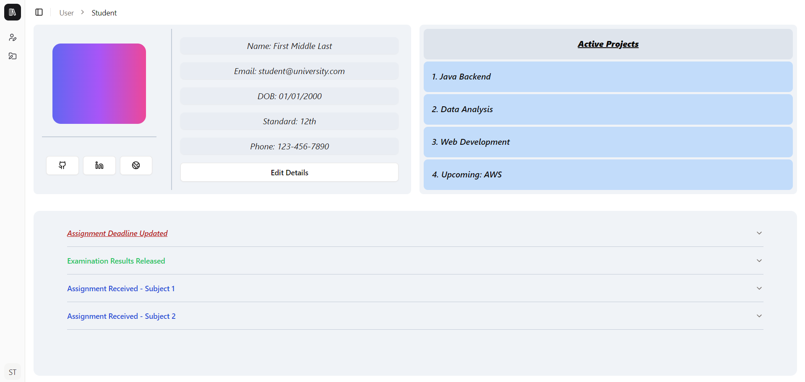
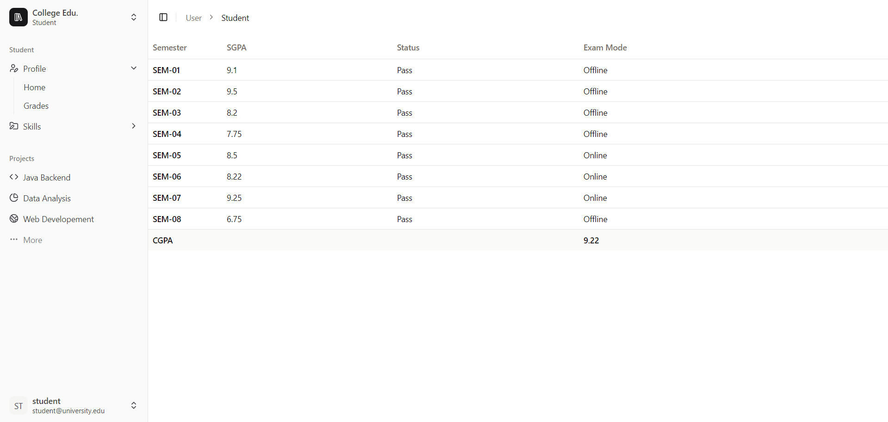
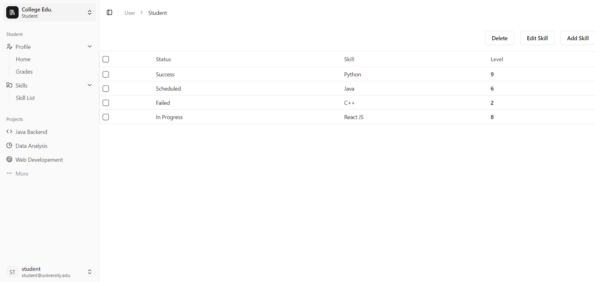
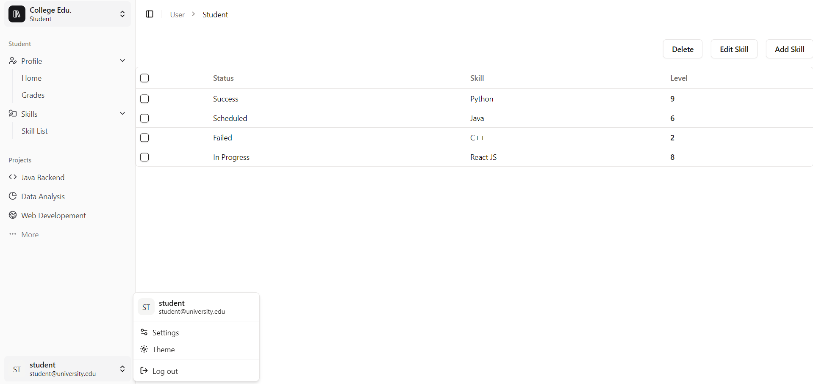

# Student Management Application

> This is a prototype application to perform common 'student management tasks'
> Features:
> 1. Profile details
> 2. Ability to update the profile information
> 3. List of projects
> 4. Notice board
> 5. List of semester wise grades
> 6. Skills list
> 7. Ability to add, update, delete and batch delete skills from the list.

### Installation Steps
```bash
git clone https://github.com/shalaka-deshpande/ViTriC-internship-app.git
npm install 
npm run dev 
```

### Application Screenshots

1. _***Homepage***_


2. _***Sidebar collapsed***_


3. _***Grades Page***_


4. _***Skills Page***_


5. _***Account Menu***_

### Dependencies

1. React JS
2. Vite
3. Tailwind CSS
4. Shadcn (component library)

### Challenges
1. Resolving Depencies.
2. State management for the `skills table`.
3. Maintaining the layout across different screen sizes.
4. Implementing routing for the SPA.
